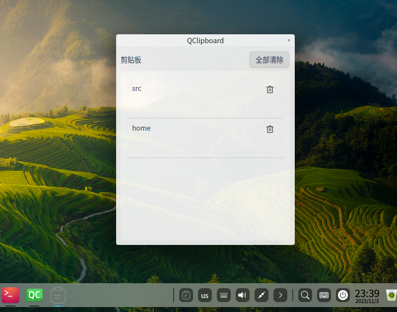

# QClipboard

[中文](README_zh.md)

## Overview
A cross-platform clipboard tool that allows selecting items from clipboard history to paste. It provides a convenient way to view clipboard history and quickly paste any previously copied content.



The global shortcut `Alt + V` can be used to display the clipboard.

## Features

- Cross-platform（Windows, macOS and Linux）
- Quickly browse clipboard history items, including text and images 
- View history from global hotkeys or system tray icon
- Delete items from history

## Building

```bash
git clone https://github.com/L-Super/QClipboard --recursive
cd QClipboard
cmake -B build
cmake --build build
```

## Todo

- [x] support image
- [ ] LAN shared clipboard

## Contributing

Contributions welcome - submit issues and pull requests.
