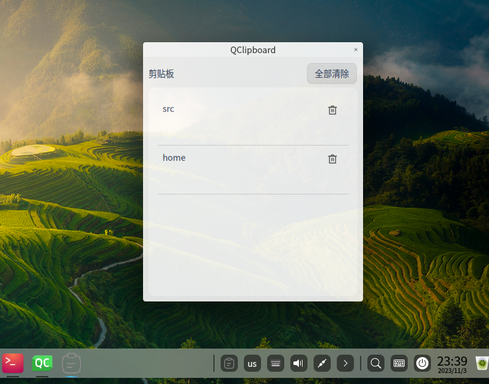

# QClipboard

[English](README.md)

## 概述

一个跨平台的剪贴板工具，可以从剪贴板历史记录中选择对应的项进行粘贴。它提供了一种查看剪贴板历史记录和快速粘贴任何以前复制的内容的简便方式。



使用全局快捷键 `Alt + V` 显示剪贴板

## 特性

+ 跨平台（Windows, Linux and ~~macOS~~）
+ 快速浏览剪贴板历史记录中的项目，包括文本和图片
+ 从全局热键或者托盘图标查看历史记录
+ 可以删除历史记录中的项目

## 编译

最低依赖要求 Qt6

```bash
git clone https://github.com/L-Super/QClipboard --recursive
cd QClipboard
cmake -B build
cmake --build build
```

## 贡献

欢迎贡献 - 提交 issue 和 PR。